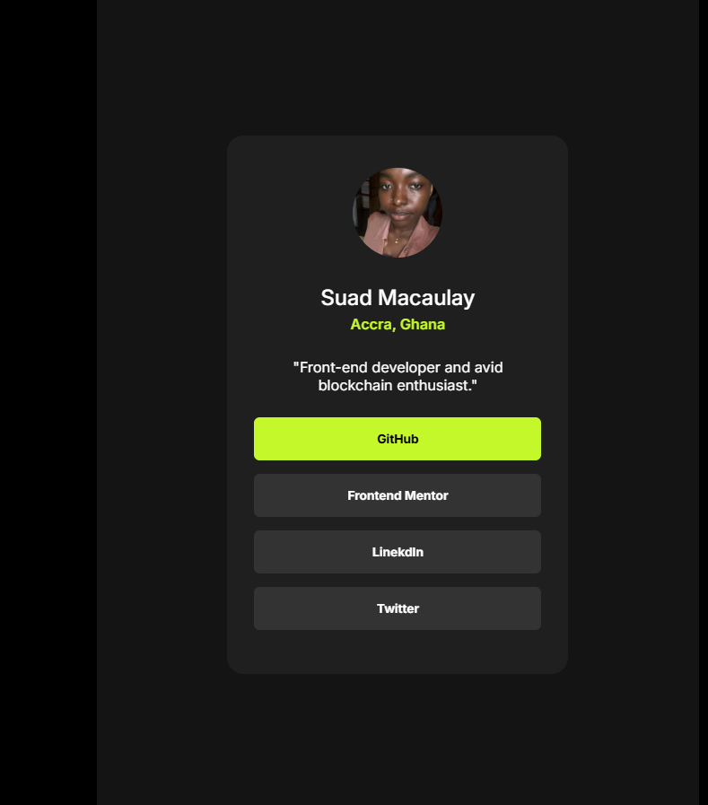

# Frontend Mentor - Social links profile solution

This is a solution to the [Social links profile challenge on Frontend Mentor](https://www.frontendmentor.io/challenges/social-links-profile-UG32l9m6dQ). Frontend Mentor challenges help you improve your coding skills by building realistic projects.

## Table of contents

- [Overview](#overview)
  - [The challenge](#the-challenge)
  - [Screenshot](#screenshot)
  - [Links](#links)
- [My process](#my-process)

  - [Built with](#built-with)
  - [What I learned](#what-i-learned)
  - [Continued development](#continued-development)

- [Author](#author)
- [Acknowledgments](#acknowledgments)

**Note: Delete this note and update the table of contents based on what sections you keep.**

## Overview

### The challenge

Users should be able to:

- See hover and focus states for all interactive elements on the page

### Screenshot



### Links

- Solution URL: [Add solution URL here](https://your-solution-url.com)
- Live Site URL: [Add live site URL here](https://your-live-site-url.com)

## My process

### Built with

- Semantic HTML5 markup
- CSS custom properties
- Flexbox
- Mobile-first workflow
- Javascript

### What I learned

Use this section to recap over some of your major learnings while working through this project. Writing these out and providing code samples of areas you want to highlight is a great way to reinforce your own knowledge.

To see how you can add code snippets, see below:

```html
<main>
  ,
  <section>
    and
    <header></header>
  </section>
</main>
```

i got to use this semantic elements to structure my code and learnt that its helps the browser know the kind of content within each element

```css
.proud-of-this-css {
  height: 100vh;
}
```

i understood the use case of this property and how it helped me solve an issue with making the height of a container the same has that of the device

```js
const proudOfThisFunc = () => {
  windows.open(site, _blank);
};
```

i decided to add javascript because i wante my users to be able to get directed to the respective site of every button clicked. To make that happen i need to use the above code.

### Continued development

Use this section to outline areas that you want to continue focusing on in future projects. These could be concepts you're still not completely comfortable with or techniques you found useful that you want to refine and perfect.

i'll like to focus on making good use of vw and vh in more projects to come

## Author

- Frontend Mentor - [@dunt21](https://www.frontendmentor.io/profile/dunt21)
- Twitter - [@moreofababe](https://www.twitter.com/moreofababe)
- LinkedIn - [@Suad Macaulay] (https://www.linkedin.com/in/suad-macaulay-429070278/?utm_source=share&utm_campaign=share_via&utm_content=profile&utm_medium=android_app)

## Acknowledgments

This is where you can give a hat tip to anyone who helped you out on this project. Perhaps you worked in a team or got some inspiration from someone else's solution. This is the perfect place to give them some credit.

I got a tip from [@NavidSadat] solution from frontend mentor with regards to the use of height: 100vh
